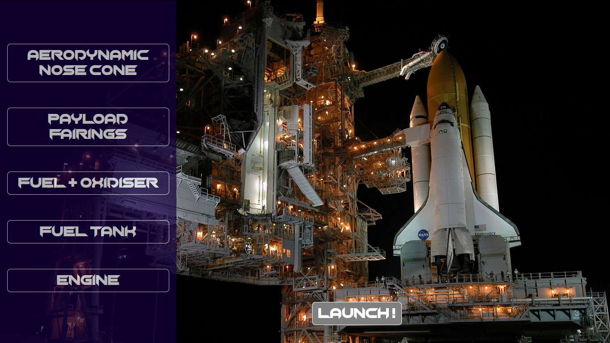

<p align="center">
  <a href="https://github.com/anshuman2051/brahmandaApp">
    
  </a>

  <h3 align="center">Brahmanda</h3>

  <p align="center">
    Space Educate Application
    <br />
    <br />
  </p>
</p>


<!-- TABLE OF CONTENTS -->
## Table of Contents

* [About the Application](#about-the-application)
  * [Built With](#built-with)
* [Getting Started](#getting-started)
  * [Prerequisites](#prerequisites)
  * [Installation](#installation)
* [Usage](#usage)
* [Contributing](#contributing)
* [Authors](#authors)


<!-- ABOUT THE PROJECT -->
## About The Application
<br />
<br />

<br />
<br />

<br />
<br />
Space exploration is a dream for many of us. But as it is a dream and the achievable reality is far from present considering threats and lack of resources, we have come up with an idea to make an interactive Application that demostrates the manufacturing of rockets and the process starting from launch prior to landing or its injection into the orbit.

Sending a Rocket from ground to space is an art of technology which started in the year 1950. There are several criterias that need to be considered for a successful launch of the rocket. It is difficult for common users to know the art without much theoretical and practical knowledge. So, In this Application we tried to show how the fundamental physical phenomena such as gravitation, inertial frames, quantum vacuum etc, the type of engines are used and other factors that affect the trajectory of the rockets.

The list of rockets ranges from the most successful ones to the ones that are being developed to make exploration of the planets and other celestial bodies possible. 

The Application is designed in such a way that it would allow users to customize their own rocket by assembling the payload system, engines and other parts to find whether their rocket would reach their defined destination or not. Also for the users who are curious to know about how these technologies work, a section is provided where the users can try understanding the technologies better.

## Built With

* [React](https://reactjs.org/)
* [Adobe XD](https://www.adobe.com/in/products/xd.html)
* [Abobe Illustrator](https://www.adobe.com/in/products/illustrator.html)
* [Adobe XD](https://www.adobe.com/in/products/photoshop.html)

## Getting Started

To get a local copy up and running follow these simple steps.

### Prerequisites

This is an example of how to list things you need to use the software and how to install them.
* npm
```sh
npm install npm@latest -g
```

### Installation

1. Clone the repo
```sh
git clone https://github.com/anshuman2051/brahmandaApp.git
```
2. Install NPM packages
```sh
npm install
```

## Usage

After the dependencies are installed, you can run the 'Brahmanda Application' by running the following command:

`npm start`

## Contributing

Contributions are what make the open source community such an amazing place to be learn, inspire, and create. Any contributions you make are **greatly appreciated**.

1. Fork the Project
2. Create your Feature Branch (`git checkout -b feature/AmazingFeature`)
3. Commit your Changes (`git commit -m 'Add some AmazingFeature'`)
4. Push to the Branch (`git push origin feature/AmazingFeature`)
5. Open a Pull Request

## Authors

* [Anshuman Singh](https://www.github.com/anshuman2051)
* [Sahil Mishra](https://github.com/sahilmishra0012)
* [Jayanta Das](https://github.com/jayantadas1602)
* [Venkatesh Desai](https://github.com/venky301)
* [Abhishek Singh](https://github.com/abhishekaashu)
* [Mrityunjay Kumar Pathak](https://github.com/pathakmrityunjaykumar)

